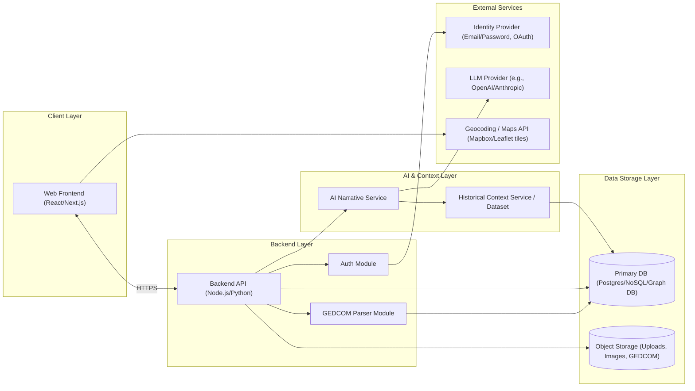

# StoryTree System Architecture (Draft v0.1)

This document provides a high-level architecture diagram (text + Mermaid) and component list for the StoryTree MVP, based on the requirements specification.

---

## 1. High-Level Architecture Overview

StoryTree is a cloud-hosted web application with the following major layers:

- **Client (Web Frontend)**
- **Backend API**
- **AI/Narrative Service**
- **Data Storage Layer (DB + Object Storage)**
- **Historical Context Service/Data**
- **Authentication/Identity Provider (IdP)**

At a glance:

- The **Web Frontend** communicates with the **Backend API** via HTTPS (REST/GraphQL).
- The **Backend API** handles authentication, project lifecycle, GEDCOM upload, parsing, and retrieval of tree/timeline/map/story data.
- The **Backend API** orchestrates calls to:
  - The **AI/Narrative Service** for generating stories.
  - The **Historical Context Service/Data** for era- and region-based context.
- All structured data is stored in a **Database**, while uploads and static assets are stored in **Object Storage**.

---

## 2. Mermaid Architecture Diagram (Logical)

You or your dev can paste this Mermaid block into tools that support Mermaid (e.g., GitHub, VS Code plugins, various diagramming tools) to visualize it.

---

## 3. Component List

### 3.1 Client Layer

**C1. Web Frontend (React/Next.js)**
Responsibilities:
- Render UI for:
  - Landing/Marketing pages
  - Authentication (login/register/reset)
  - Project list/dashboard
  - GEDCOM upload wizard
  - Project Overview
  - Family Tree view
  - Person Story view
  - Timeline view
  - Map view
  - Stories/Chapters view
  - Settings & Sharing
- Manage client-side routing and state (e.g., via React Router/Next routing + state management library).
- Interact with Backend API via REST/GraphQL.
- Provide responsive layout and accessibility (WCAG 2.1 AA where possible).

Key submodules:
- **UI Shell & Navigation** (header, sidebars, project selector)
- **Upload Module** (file drop, validation feedback)
- **Tree Visualization Module** (D3/visx-based)
- **Timeline Module** (events and episodes visualization)
- **Map Module** (Mapbox/Leaflet integration)
- **Story Editor Module** (rich text editor for narratives)
- **Auth Views** (login, register, password reset)
- **Sharing/Link Management UI**

---

### 3.2 Backend Layer

**C2. Backend API Service (Node.js or Python)**
Responsibilities:
- Expose authenticated REST/GraphQL endpoints for:
  - User and session management
  - Project CRUD
  - GEDCOM upload and import orchestration
  - Retrieval of individuals, relationships, events
  - Retrieval and update of narrative episodes
  - Summary data (stats for dashboard, key locations, date ranges)
  - Sharing link creation and revocation
- Apply authorization and ownership checks.
- Coordinate with GEDCOM Parser, AI/Narrative Service, and Data Storage.

Submodules:
- **Auth Module**
  - JWT/session handling
  - Integration with Identity Provider (IdP)
- **Project Module**
  - Project CRUD, metadata, sharing settings
- **GEDCOM Import Module**
  - Routes for uploading files
  - Calls GEDCOM Parser
  - Error handling and progress tracking
- **Family Tree Module**
  - APIs for fetching individuals, relationships, and branch summaries
- **Narrative Module**
  - Endpoints to request generation/regeneration of narratives
  - Narrative retrieval and updates
- **Timeline & Map Module**
  - Aggregates events by time and location for UI
- **Export Module (MVP basic)**
  - (Optional) simple PDF/story export endpoints

**C3. GEDCOM Parser Module**
Responsibilities:
- Parse GEDCOM `.ged` files.
- Extract individuals, families, relationships, and events.
- Normalize data into internal models:
  - Person
  - Relationship
  - Event (birth, marriage, death, residence, immigration, etc.)
- Handle malformed/partial data gracefully; return informative errors.

Implementation notes:
- Can be a library within Backend API, or a separate microservice if needed for scalability.
- Should be unit-tested with a variety of GEDCOM files.

**C4. Auth Module**
Responsibilities:
- Handle login, registration, and password resets.
- Integrate with IdP (could be an external auth provider or self-hosted solution).
- Ensure all project and narrative operations are properly authorized.

---

### 3.3 AI & Context Layer

**C5. AI Narrative Service**
Responsibilities:
- Accept narrative generation requests with structured inputs:
  - Person data (dates, places, relationships, events)
  - Contextual data (project summary, time range, branch metadata)
  - Historical context (if pre-fetched or referenced)
- Construct and send prompts to the LLM provider.
- Post-process LLM responses:
  - Enforce section structure (Early Life, Work & Daily Life, Family & Home, Historical Context).
  - Limit length according to configuration.
  - Ensure basic safety filters (no hallucinated certainty about unknown sensitive topics).
- Return narrative in a structured format (JSON with sections, title, summary).

Integration:
- Exposed to Backend API via internal HTTP/GRPC or as a library.
- Uses environment-configured credentials for LLM provider (e.g., OpenAI/Anthropic).

**C6. Historical Context Service / Dataset**
Responsibilities:
- Provide historical summaries keyed by time range and region:
  - Major wars and political events
  - Economic conditions
  - Migration patterns
  - Typical occupations/industries
- Serve as an input into AI Narrative prompts.
- May be implemented as:
  - A small internal API backed by a database table (Events, Regions, Descriptions).
  - A static dataset loaded into memory (for MVP).

---

### 3.4 Data Storage Layer

**C7. Primary Database**
Options: Postgres (with JSONB for flexible fields), a graph database (Neo4j), or a document store (MongoDB).
Responsibilities:
- Store:
  - Users & auth metadata
  - Projects & settings
  - Persons & relationships
  - Events (birth, marriage, death, residence, etc.)
  - Generated narratives and user edits
  - Sharing links and tokens
- Support indexing for efficient queries:
  - By project ID
  - By person ID
  - By time ranges and locations (for timeline/map)

**C8. Object Storage**
Responsibilities:
- Store:
  - Raw GEDCOM uploads
  - User-uploaded photos and documents
  - Derived assets (thumbnails, map snapshots, PDF exports)
- Provide secure, time-limited access URLs to the frontend.

---

### 3.5 External Services

**C9. Identity Provider (IdP)**
Responsibilities:
- Handle user authentication (email/password and/or social login).
- Issue tokens (JWT/OAuth) used by Backend API.
- Could be implemented via:
  - Auth0, Cognito, Firebase Auth, or a self-hosted solution.

**C10. LLM Provider**
Responsibilities:
- Process text generation requests from the AI Narrative Service.
- Provide usage metrics and enforce rate limits.
- Must be configured securely (API keys, regional compliance).

**C11. Maps/Geocoding Provider**
Responsibilities:
- Map tiles for Map view (e.g., Mapbox, OpenStreetMap).
- Optional geocoding for free-text locations into coordinates.

---

## 4. Data Model (High-Level Entities)

- **User**
  - id, email, password hash (if self-managed), created_at, etc.

- **Project**
  - id, user_id, name, created_at, updated_at
  - date_range_start, date_range_end
  - cover_image_url (optional)
  - sharing settings (share_link_token, is_share_enabled)

- **Person**
  - id, project_id
  - given_name, surname, gender
  - birth_date, birth_place
  - death_date, death_place
  - other_facts (JSON)

- **Relationship**
  - id, project_id
  - type (parent-child, spouse)
  - person_id_1, person_id_2

- **Event**
  - id, project_id, person_id (nullable for family events)
  - type (birth, marriage, death, residence, immigration, etc.)
  - date, place_text, geo_lat, geo_lon

- **NarrativeEpisode**
  - id, project_id, person_id (or group/branch id)
  - title, summary
  - sections (JSON: early_life, work_daily_life, family_home, historical_context)
  - is_user_edited (bool)
  - created_at, updated_at

- **HistoricalContextSnippet**
  - id
  - region_key (e.g., state/county/country)
  - time_range (start_year, end_year)
  - type (war, economic, cultural)
  - description

---

## 5. Request/Response Workflow Examples

### 5.1 GEDCOM Import

1. **Frontend**: POST `/projects/{id}/import-gedcom` with file.
2. **Backend API**:
   - Validates file.
   - Stores file in Object Storage.
   - Calls GEDCOM Parser to parse into internal model.
   - Writes Persons, Relationships, Events into DB.
   - Computes summary stats and updates Project metadata.
3. **Frontend**:
   - Polls or uses WebSocket/progress endpoint to show "Building your family's story…".
   - On completion, redirects user to Project Overview.

### 5.2 Narrative Generation for a Person

1. **Frontend**: POST `/projects/{id}/persons/{personId}/generate-story`.
2. **Backend API**:
   - Fetches Person, related Events, key Relationships from DB.
   - Fetches or derives project-level context (branch, locations, date range).
   - Calls Historical Context service for region/time snippets.
   - Calls AI Narrative Service with structured payload.
   - Receives structured narrative JSON and saves it as NarrativeEpisode.
3. **Frontend**:
   - Updates UI with new episode, enabling Person Story view.

---

## 6. Deployment Considerations (MVP)

- **Frontend**:
  - Deployed as static assets (e.g., on Vercel/Netlify/S3+CloudFront) or as part of a Next.js SSR app.

- **Backend API + GEDCOM Parser + AI Narrative Service**:
  - Deployed as containerized services (Docker) on a cloud provider (e.g., AWS ECS/EKS, GCP Cloud Run, Heroku-like PaaS).
  - API Gateway or load balancer in front.

- **Database & Object Storage**:
  - Managed database service (e.g., AWS RDS, GCP Cloud SQL, Mongo Atlas, Neo4j Aura).
  - Managed object storage (e.g., S3, GCS).

- **External Services**:
  - Auth, LLM, and Maps configured via environment variables and secrets management (e.g., AWS Secrets Manager).

---

This architecture is intentionally modular so you can start with a monolithic backend (API + Parser + Narrative service in one codebase) and later split out services (e.g., AI Narrative Service) if scale or complexity demands it.
